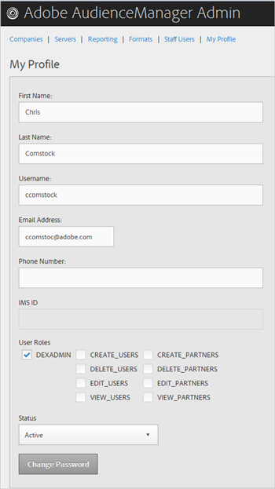
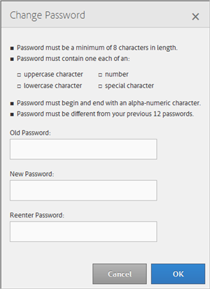

# 我的配置文件 {#my-profile}

编辑Audience Manager管理工具配置文件的详细信息或更改密码。

<!-- c_my_profile.xml -->

## 编辑个人资料 {#edit-profile}

查看和编辑您的Audience Manager管理工具配置文件，包括名字和姓氏、用户名、电子邮件地址、电话号码、 [!UICONTROL IMS ID]、用户角色和状态。

<!-- t_edit_profile.xml -->

1. 单击 **[!UICONTROL My Profile]**.

   

2. 填写以下字段：
   * **[!UICONTROL First Name]：** （必需）指定您的名字。
   * **[!UICONTROL Last Name]：** （必需）指定您的姓氏。
   * **[!UICONTROL Username]：** （必需）指定您的第一个用户名。
   * **[!UICONTROL Email Address]：** （必需）指定您的电子邮件地址。
   * **[!UICONTROL Phone Number]：** 指定您的电话号码。
   * **[!UICONTROL IMS ID]：** 指定您的Internet消息服务ID。
   * **[!UICONTROL User Roles]：** 选择所需的用户角色：
      * **[!UICONTROL DEXADMIN]：** 提供在“Audience Manager管理工具”中执行任务的管理员访问权限。 如果不选择此选项，则可以选择单个角色。 这些角色让用户可以使用以下方式执行任务 [!DNL API] 调用，但不在管理工具中。
      * **[!UICONTROL CREATE_USERS]：** 允许用户使用创建新用户 [!DNL API] 呼叫。
      * **[!UICONTROL DELETE_USERS]：** 允许用户使用删除现有用户 [!DNL API] 呼叫。
      * **[!UICONTROL EDIT_USERS]：** 允许用户使用编辑现有用户 [!DNL API] 呼叫。
      * **[!UICONTROL VIEW_USERS]：** 允许用户使用查看您的Audience Manager配置中的其他用户 [!DNL API] 呼叫。
      * **[!UICONTROL CREATE_PARTNERS]：** Audience Manager允许用户使用 [!DNL API] 呼叫。
      * **[!UICONTROL DELETE_PARTNERS]：** Audience Manager允许用户使用 [!DNL API] 呼叫。
      * **[!UICONTROL EDIT_PARTNERS]：** Audience Manager允许用户使用 [!DNL API] 呼叫。
      * **[!UICONTROL VIEW_PARNTERS]：** Audience Manager允许用户使用 [!DNL API] 呼叫。
   * **[!UICONTROL Status]：** 选择所需的状态：
      * **[!UICONTROL Active]：** 指定此用户为活动Audience Manager用户。
      * **[!UICONTROL Deactivated]：** 指定此用户是Audience Management中的已停用用户。
      * **[!UICONTROL Expired]：** 指定此用户帐户在Audience Manager中的帐户已过期。
      * **[!UICONTROL Locked Out]：** 指定此用户帐户在Audience Manager中的帐户已锁定。
3. 单击 **[!UICONTROL Submit]**.

## 更改密码 {#change-password}

更改Audience Manager管理工具密码。

<!-- t_change_password.xml -->

1. 单击 **[!UICONTROL My Profile]**.
1. 单击 **[!UICONTROL Change Password]**.

   

   您的Audience Manager密码必须是：

   * 长度至少为8个字符；
   * 至少包含一个大写字符；
   * 至少包含一个小写字符；
   * 至少包含一个数字；
   * 至少包含一个特殊字符；
   * 以字母数字字符开头和结尾；
   * 以字母数字字符开头和结尾。

1. 指定您的旧密码。
1. 指定新密码，然后确认新密码。
1. 单击 **[!UICONTROL OK]**.
