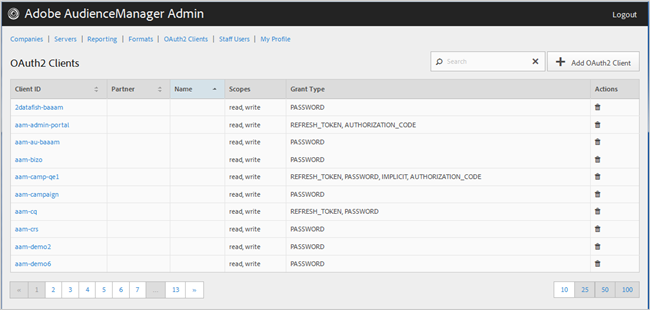

# OAuth2 客户端 {#oauth-clients}

使用该 [!UICONTROL OAuth2 Clients] 页视图配置中的 [!UICONTROL OAuth2] 列表客户 [!DNL Audience Manager] 端。 您可以编辑或删除现有客户端或创建新客户端，前提是您已分配了相应的用户角色。

## 概述 {#overview}

<!-- c_oauth.xml -->

>[!NOTE]
>
>确保您的客户阅读《Audience Manager [用户指南](https://docs.adobe.com/content/help/en/audience-manager/user-guide/api-and-sdk-code/rest-apis/aam-api-getting-started.html#oauth) 》中的OAuth2文档。

[!DNL OAuth2] 是一个开放的授权标准，用于代表资源所有者 [!DNL Audience Manager] 提供对资源的安全委托访问。

单击所需列的标题，可以按升序或降序对每列进行排序。

使用 [!UICONTROL Search] 列表底部的框或分页控件找到所需的客户端。

## 创建或编辑OAuth2客户端 {#create-edit-client}

<!-- t_create_edit_auth.xml -->

使用Audience Manager [!UICONTROL OAuth2 Clients] 工具中的页 [!UICONTROL Admin] 面创建新客户 [!UICONTROL Oauth2] 端或编辑现有客户端。

1. 要创建新客户端， [!UICONTROL OAuth2] 请单击 **[!UICONTROL OAuth2 Clients]** > **[!UICONTROL Add OAuth2 Client]**。 要编辑现有客 [!UICONTROL OAuth2] 户端，请在列中单击所需的客 **[!UICONTROL Client ID]** 户端。
1. 指定此客户端的所需 [!UICONTROL OAuth2] 名称。 请注意，这是仅记录的名称。
1. 指定客 [!UICONTROL OAuth2] 户端的电子邮件地址。 电子邮件地址限制为一个。
1. 从下 **[!UICONTROL Partner]** 拉列表中，选择所需的合作伙伴。
1. 在框 **[!UICONTROL Client ID]** 中，指定所需的ID。 这是提交请求时使用的 [!DNL API] 值。 前缀在您从上一步的下拉开始中选 [!UICONTROL Partner] 择列表后键入时自动填充。 正确的格式为 *`partner subdomain`*&lt;> - *`Audience Manager username`*&lt;>。
1. 根据需要选 **[!UICONTROL Restrict to Partner Users]** 中或取消选中复选框。 如果选中此复选框，则用户必须是选定 [!DNL Audience Manager] 合作伙伴的列出用户。 作为最佳实践，我们建议您选择此选项。
1. 在部分 **[!UICONTROL Scope]** 中，根据需要选择或取 **[!UICONTROL Read]** 消选 **[!UICONTROL Write]** 中相应的和复选框。
1. 在部分 **[!UICONTROL Grant Type]** 中，选择所需的授权方式。 我们建议您使用默认设置和 [!UICONTROL Password] 选项 [!UICONTROL Refresh-token] 。

   * **[!UICONTROL Implicit]**:如果选择此选项，则 [!UICONTROL Redirect URI] 将启用框。 用户在经过身份验证后被赋予自动访问令牌，并立即被发送到重定向 [!DNL URI]。
   * **[!UICONTROL Authorization Code]**:如果选择此选项，则 [!UICONTROL Redirect URI] 将启用框。 用户在经过身份验证后返回到客户端，然后被发送到重定向 [!DNL URI]。
   * **[!UICONTROL Password]**:使用用户输入的口令而不是通过授权服务器进行自动式校验尝试来验证用户。
   * **[!UICONTROL Refresh_token]**:用于刷新已过期访问令牌的较长时间。

1. 在框 **[!UICONTROL Redirect URI]** 中，指定所需 [!DNL URI]。 仅当您选择类型和授予类型时，才 **[!UICONTROL Implicit]** 启用 **[!UICONTROL Authorization_code]** 此选项。 在该 **[!UICONTROL Redirect URI]** 框中，可以指定可接受值的以逗号分隔 [!DNL URI] 的值。 这是在批准 [!DNL URI] 客户端进行访问后，将客户端的用户重定向到的 [!DNL API] 用户。
1. 指定访问和刷新令牌到期所需的到期时间（以秒为单位）。

   * **[!UICONTROL Access Token Expiration Time]**:发出访问令牌后有效的秒数。 使用平台默认值（12小时）可为null。 也可以是-1，表示访问令牌未过期。
   * **[!UICONTROL Refresh Token Expiration Time]**:发出刷新令牌后有效的秒数。 使用平台默认值（30天）可为null。

1. 单击 **[!UICONTROL Save]**.

要删除客 [!UICONTROL OAuth2] 户端，请单 **[!UICONTROL OAuth2 Clients]**&#x200B;击，然后  单击所 **[!UICONTROL Actions]** 需客户端的列。

>[!MORELIKETHIS]
>
>* [API 要求和建议](../admin-oauth2/aam-admin-api-requirements.md)

