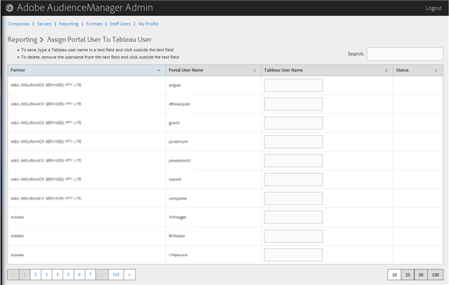

# 将门户用户分配给表用户 {#assign-a-portal-user-to-tableau-user}

<!-- t_tabeau.xml -->

使用页 [!UICONTROL Reporting] 面使门户用户成为用 [!DNL Tableau] 户。 这样，用户便可以在Audience manager [!DNL Tableau] 中查看报告。

1. Click **[!UICONTROL Reporting]** &gt; **[!UICONTROL Assign Portal User to Tableau User]**.

   

1. 要分配用户，请在所需的合作伙伴行中，在文本字 [!DNL Tableau] 段中键入用户名，然后单击文本字段外的。

要删除用户签名，请在所需的合作伙伴行中，从文本字段中删除用户名，然后单击文本字段外部的。
