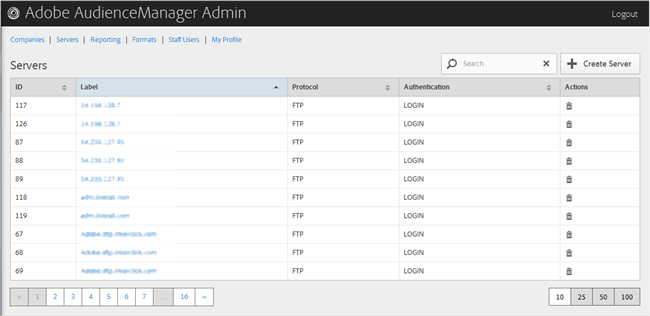

# 服务器概述 {#servers-overview}

使用[!UICONTROL Servers]页视图Audience Manager配置中的一列表服务器。 您可以编辑或删除现有服务器或创建新服务器，前提是您分配了适当的用户角色。

<!-- c_servers.xml -->

单击所需列的标题，可以按升序或降序对每列进行排序。 使用[!UICONTROL Search]框或列表底部的分页控件找到所需的服务器。