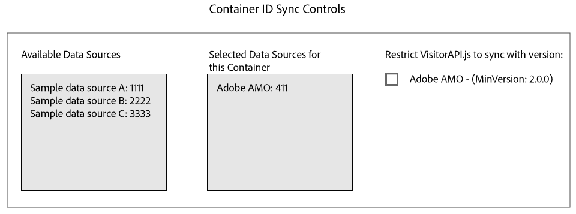

# ID 与 Media Optimizer 同步{#id-syncing-with-media-optimizer}

默认情况下，所有公司都将数据 [!DNL Adobe Media Optimizer] 与([!DNL AMO])同步。 在中， [!UICONTROL Admin UI]每个公司容器都有一个管理此过程的数据源。 此数据源 [!UICONTROL Adobe AMO] 为([!UICONTROL ID] 411)。 单击选定容器的公司行( [!UICONTROL Containers] 在选项卡下)，以禁用此默认同步，或向同步过程添加和删除其 [!DNL AMO] 他数据源。

## ID同步状态 {#id-sync-status}

下表描述了数据源的同步状态。

| 状态 | 描述 |
|------ | -------- |
| 关 | 从此容器删除所 [!UICONTROL Selected Data Sources] 有数据源以禁用ID同步 [!DNL AMO] |
| 开启（无论ID服务版本如何） | 在以下情况下，无论ID服 [!DNL AMO] 务版本如何，数据源都会同步： <ul><li>列表中显示数据源。 [!UICONTROL Selected Data Sources]</li><li>未 [!DNL AMO] 选中 *该复选框* 。</li></ul> |
| 开启（无论ID服务版本如何） | 在以下情况下，数据 [!DNL AMO] 源将与ID服务版本2.0（或更高版本）同步： <ul><li>列表中显示数据源。 [!UICONTROL Selected Data Sources]</li><li>此 [!DNL AMO] 复选框 *已选* 中。</li></ul> |

>[!MORELIKETHIS]
>
>* [管理容器](../companies/admin-manage-containers.md#task_61DB5CEECC5049DD8D059C642AC3F967)

