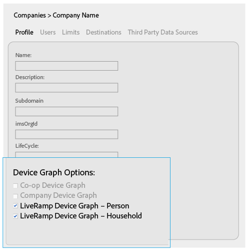
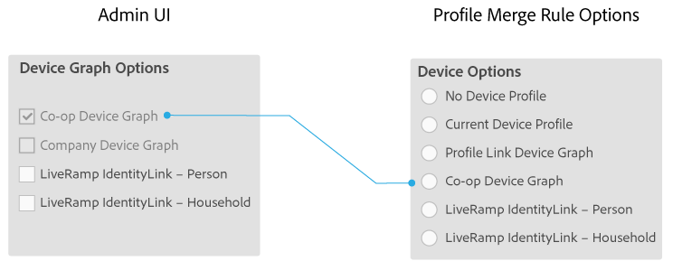
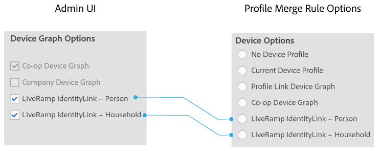

# 适用于公司的设备图表选项 {#device-graph-options-for-companies}

[!UICONTROL Device Graph Options] 可供参与该计划的公司 [!DNL Adobe Experience Cloud Device Co-op]使用。如果客户还与与Audience Manager集成的第三方设备图提供商有合同关系，则此部分将显示该设备图的选项。这些选项位于 [!UICONTROL Companies] &gt;公司名称&gt; [!UICONTROL Profile] &gt; [!UICONTROL Device Graph Options]。

此插图使用第三方设备图表选项的通用名称。在生产中，这些名称来自设备图表提供商，并且可能因此处显示的内容而异。例如 [!DNL LiveRamp] ，选项通常(但并非始终)：

* 从 "[!DNL LiveRamp]"
* 包含不同的中间名称
* 以“[!UICONTROL - Household]或”结尾[!UICONTROL -Person]

## 已定义设备图表选项 {#device-graph-options-defined}

在此处选择的设备图表选项会显示 [!UICONTROL Device Options] 或隐藏 [!DNL Audience Manager] 客户创建的选项 [!UICONTROL Profile Merge Rule]。

### 计划设备图表 {#co-op-graph}

参与 [Adobe Experience Cloud Device Co-op](https://marketing.adobe.com/resources/help/en_US/mcdc/) 的客户使用这些选项来创建 [!UICONTROL Profile Merge Rule][具有确定性和概率数据](https://marketing.adobe.com/resources/help/en_US/mcdc/mcdc-links.html)的产品。激活 [!DNL Corporate Provisioning Team] 并通过后端 [!DNL API] 调用取消激活此选项。您无法在中选中或清除这些框 [!DNL Admin UI]。此外，这些 **[!UICONTROL Co-op Device Graph]****[!UICONTROL Company Device Graph]** 选项和选项是互斥的。客户可以要求我们激活一个或另一个，但不能同时激活两者。选中此项后，会在设置 **[!UICONTROL Co-op Device Graph]**[!UICONTROL Device Options] 的设置中显示控件 [!UICONTROL Profile Merge Rule]。

### 公司设备图表 {#company-graph}

此选项适用于 [!DNL Analytics] 在其报告套件中使用该 [!UICONTROL People] 量度 [!DNL Analytics] 的客户。激活 [!DNL Corporate Provisioning Team] 并通过后端 [!DNL API] 调用取消激活此选项。您无法在中选中或清除这些框 [!DNL Admin UI]。此外，这些 **[!UICONTROL Company Device Graph]****[!UICONTROL Co-op Device Graph]** 选项和选项是互斥的。客户可以要求我们激活一个或另一个，但不能同时激活两者。选中时：

* 此设备图表使用属于所配置公司的确定数据(无概率数据)。
* [!DNL Audience Manager] 自动创建 [!UICONTROL Data Source] 一个名为 `*`合作伙伴名称的名称`*-Company Device Graph-Person`。[!UICONTROL Data Source] 在详细信息页面中 [!DNL Audience Manager] ，客户可以更改合作伙伴名称、说明，并将 [数据导出控制](https://marketing.adobe.com/resources/help/en_US/aam/c_dec.html) 应用到此数据源。
* [!DNL Audience Manager] 客户 *在此部分* 中看不到新 [!UICONTROL Device Options][!UICONTROL Profile Merge Rule]的设置。

### LiveMP设备图表(人物或家用) {#liveramp-device-graph}

在合作伙伴创建 [!DNL Admin UI][!UICONTROL Data Source] 和选择 **[!UICONTROL Use as an Authenticated Profile]** 和/或 **[!UICONTROL Use as a Device Graph]**&#x200B;操作时，这些复选框处于启用状态。这些设置的名称由第三方设备图表提供商确定(例如， [!DNL LiveRamp]等 [!DNL TapAd])。选中此选项后，即表示您正在配置的公司将使用这些设备图提供的数据。

>[!MORE_ LIKE_ This]
>
>* [已定义配置文件合并规则选项](https://marketing.adobe.com/resources/help/en_US/aam/merge-rule-definitions.html)
>* [数据源设置和菜单选项](https://marketing.adobe.com/resources/help/en_US/aam/datasource-settings-definitions.html)

