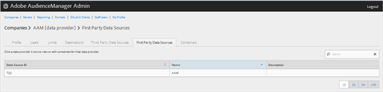
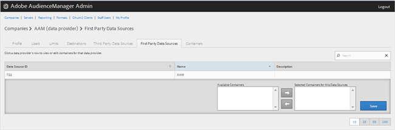

# 管理第一方数据提供商 {#manage-first-party-data-providers}

查看或编辑第一方数据提供商的容器和映射。

<!-- t_first_party_providers.xml -->

1. 单击 **[!UICONTROL Companies]**，然后找到并单击所需的公司以显示其 [!UICONTROL Profile] 页面。 使用 [!UICONTROL Search] 框或列表底部的分页控件以查找所需的公司。 您可以通过单击所需列的标题，按升序或降序对每个列进行排序。

1. 单击 **[!UICONTROL First Party Data Providers]** 选项卡。

   

1. 单击数据提供程序的行可查看或编辑该数据提供程序的容器和映射。

   

1. 将容器从 **[!UICONTROL Available Containers]** 和 **[!UICONTROL Selected Containers for This Data Provider]** 列表的方法是选择所需的容器，然后根据需要单击向右或向左箭头。
1. 单击 **[!UICONTROL Save]** 如果您进行了更改。
