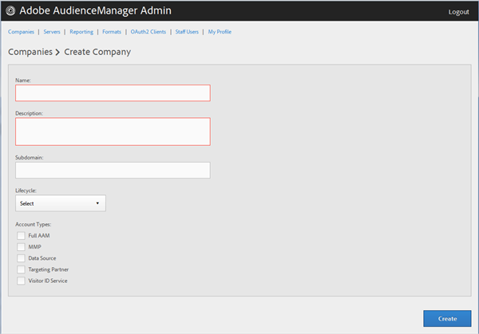
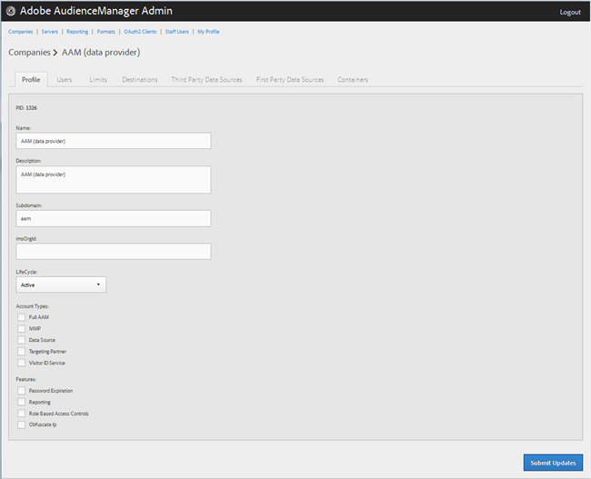
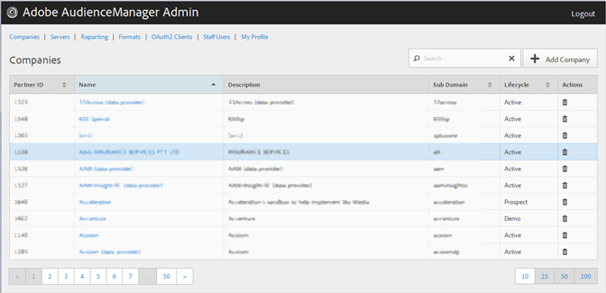

# 创建公司配置文件 {#create-a-company-profile}

使用Audience [!UICONTROL Companies] Manager管理工具中的页面创建新公司。

<!-- t_create_company.xml -->

>[!NOTE]
>
>要创建新公 **[!UICONTROL DEXADMIN]** 司，您必须具有角色。

1. Click **[!UICONTROL Companies]** &gt; **[!UICONTROL Add Company]**.
1. 填写以下字段：

   * **[!UICONTROL Name]**:（必需）指定公司名称。
   * **[!UICONTROL Description]**:（必需）提供有关公司的描述性信息，如行业或其全名。
   * **[!UICONTROL Subdomain]**:（必需）指定公司的子域。 您输入的文本显示为事件调用的子域。 无法更改。 它必须是一串有效 [!DNL URL]的字符。

      例如，如果您的公司被命 [!DNL AcmeCorp]名，子域将被命名 [!DNL acmecorp]。

      Audience manager将子域用 [!UICONTROL Data Collection Server]于([!UICONTROL DCS])。 在上一个示例中，如果您公司的完整 [!DNL URL] 状态 [!UICONTROL DCS] 为 [!DNL acmecorp.demdex.net]。

   * **[!UICONTROL Lifecyle]**:为公司指定所需的阶段：
      * **[!UICONTROL Active]**:指定公司将是活动的Audience Manager客户端。 帐 [!UICONTROL Active] 户是指付费客户，不仅是咨询客户，还是Audience Manager SKU客户。
      * **[!UICONTROL Demo]**:指定公司仅用于演示目的。 报告数据将自动伪造。
      * **[!UICONTROL Prospect]**:指定公司是潜在的Audience manager客户，如为公司免费或为销售演示 [!DNL POC] 设置帐户。
      * **[!UICONTROL Test]**:指定公司仅用于内部测试目的。
   * **[!UICONTROL Account Types]**:为此公司指定完整的帐户类型集。 没有帐户类型与任何其他类型相互排斥。
      * **[!UICONTROL Full AAM]**:指定公司将拥有完整的Adobe Audience Manager帐户，且用户将拥有登录访问权限。
      * **[!UICONTROL MMP]**:指定公司已启用( [!UICONTROL Master Marketing Profile] )功[!UICONTROL MMP]能。 The [!UICONTROL MMP] allows audiences to be shared across the Experience Cloud using an [!UICONTROL Experience Cloud ID] ([!DNL MCID]) that is assigned to every visitor and then used by Audience Manager. 如果选择此帐户类型，则 [!UICONTROL Experience Cloud ID Service] 也会自动选择。

         有关详细信息，请参 [阅受众服务——主营销档案](https://marketing.adobe.com/resources/help/en_US/mcloud/audience_library.html)。
   * **[!UICONTROL Data Source]**:指定公司是Audience manager中的第三方数据提供商。
   * **[!UICONTROL Targeting Partner]**:指定公司充当Audience manager客户的定位平台。
   * **[!UICONTROL Visitor ID Service]**:指定公司已启用以使用 [!UICONTROL Experience Cloud Visitor ID Service]。

      它可 [!UICONTROL Experience Cloud Visitor ID Service] 以跨Experience cloud解决方案提供通用访客ID。 For more information, see the [Experience Cloud Visitor ID Service user guide](https://marketing.adobe.com/resources/help/en_US/mcvid/mcvid-overview.html).

   * **[!UICONTROL Agency]**:指定公司将拥有帐 [!UICONTROL Agency] 户。

1. 单击 **[!UICONTROL Create]**. 继续按照编辑公司 [配置文件中的说明操作](../companies/admin-manage-company-profiles.md#edit-company-profile)。

   

## 编辑公司配置文件 {#edit-company-profile}

编辑公司的配置文件，包括其名称、描述、子域、生命周期等。

<!-- t_edit_company_profile.xml -->

1. 单 **[!UICONTROL Companies]**&#x200B;击，然后找到并单击所需的公司以显示其 [!UICONTROL Profile] 页面。

   使用列 [!UICONTROL Search] 表底部的框或分页控件查找所需的公司。 您可以通过单击所需列的标题，按升序或降序对每列进行排序。

   

1. 根据需要编辑字段：

   * **[!UICONTROL Name]**:编辑公司名称。 这是必填字段。
   * **[!UICONTROL Description]**:编辑公司的说明。 这是必填字段。
   * **[!UICONTROL Subdomain]**:（必需）指定公司的子域。 您输入的文本显示为事件调用的子域。 无法更改。 它必须是一串有效 [!DNL URL]的字符。

      例如，如果您的公司被命 [!DNL AcmeCorp]名，子域将被命名 [!DNL acmecorp]。

      Audience manager将子域用 [!UICONTROL Data Collection Server] 于([!UICONTROL DCS])。 在上一个示例中，如果您公司的完整 [!DNL URL] 状态 [!UICONTROL DCS] 为 [!DNL acmecorp.demdex.net]。

   * **[!UICONTROL imsOrgld]**:([!UICONTROL Identity Management System Organization ID])通过此ID，您可以将您的公司与Adobe Experience Cloud连接。
   * **[!UICONTROL Lifecyle]**:为公司指定所需的阶段：
      * **[!UICONTROL Active]**:指定公司将是活动的Audience Manager客户端。 有效帐户是指付费客户，不仅是咨询客户，还是Audience Manager SKU客户。
      * **[!UICONTROL Demo]**:指定公司仅用于演示目的。 报告数据将自动伪造。
      * **[!UICONTROL Prospect]**:指定公司是潜在的Audience manager客户，如为公司免费或为销售演示 [!DNL POC] 设置帐户。
      * **[!UICONTROL Test]**:指定公司仅用于内部测试目的。
   * **[!UICONTROL Account Types]**:为此公司指定完整的帐户类型集。 没有帐户类型与任何其他类型相互排斥。
      * **[!UICONTROL Full AAM]**:指定公司将拥有完整的Adobe Audience Manager帐户，且用户将拥有登录访问权限。
      * **[!UICONTROL MMP]**:指定公司已启用主营销配置文件([!UICONTROL MMP])功能。

         如果选择此帐户类型，则 **[!UICONTROL Visitor ID Service]** 也会自动选择。
有关详细信息，请参 [阅受众服务——主营销档案](https://marketing.adobe.com/resources/help/en_US/mcloud/audience_library.html)。
   * **[!UICONTROL Data Source]**:指定公司是Audience manager中的第三方数据提供商。
   * **[!UICONTROL Targeting Partner]**:指定公司充当Audience manager客户的定位平台。
   * **[!UICONTROL Visitor ID Service]**:指定公司已启用Experience cloud访客ID服务。

      Experience Cloud 访客 ID 服务可以跨多个 Experience Cloud 解决方案提供一个通用的访客 ID。For more information, see the [Experience Cloud Visitor ID Service user guide](https://microsite.omniture.com/t2/help/en_US/mcvid/mcvid_service.html).

   * **[!UICONTROL Agency]**:指定公司将具有代理帐户。
   * **[!UICONTROL Features]**:选择所需的选项：
      * **[!UICONTROL Password Expiration]**:将该公司内的所有用户密码设置为在90天后过期，以提高Audience Manager的安全性。
      * **[!UICONTROL Reporting]**:为此公司启用Audience manager报告。
      * **[!UICONTROL Role Based Access Controls]**:为此公司启用基于角色的访问控制。 基于角色的访问控制允许您创建具有不同访问权限的用户组。 然后，这些用户组中的个人用户只能访问Audience Manager中的特定功能。

1. 单击 **[!UICONTROL Submit Updates]**.

## 删除公司配置文件 {#delete-company-profile}

使用Audience Manager [!UICONTROL Companies] 工具中的页 [!UICONTROL Admin] 面删除现有公司。

<!-- t_delete_company.xml -->

>[!NOTE]
>
>要删除现有 [!UICONTROL DEXADMIN] 公司，您必须具有角色。

1. 要删除现有公司，请单击 **[!UICONTROL Companies]**。

   

1. 单  击所 **[!UICONTROL Actions]** 需公司的列。
1. Click **[!UICONTROL OK]** to confirm the deletion.
