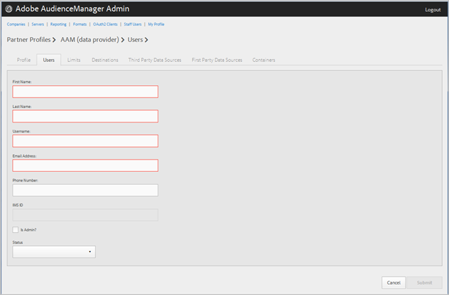

# 管理公司用户 {#manage-company-users}

创建新Audience Manager用户或编辑和删除现有用户。

<!-- t_manage_company_users.xml -->

1. 单击 **[!UICONTROL Companies]**，然后找到并单击所需的公司以显示其 [!UICONTROL Profile] 页面。

   使用 [!UICONTROL Search] 框或列表底部的分页控件以查找所需的公司。 您可以通过单击所需列的标题，按升序或降序对每个列进行排序。
1. 单击 **[!UICONTROL Users]** 选项卡。
1. 要创建新用户，请单击 **[!UICONTROL Create a New User]**. 要编辑现有用户，请找到并单击所需的用户 **[!UICONTROL Username]** 列。

   

1. 填写以下字段：

   * **[!UICONTROL First Name]**：（必需）指定用户的名字。
   * **[!UICONTROL Last Name]**：（必需）指定用户的姓氏。
   * **[!UICONTROL Username]**：（必需）指定用户的Audience Manager用户名。 用户名必须是唯一的。
   * **[!UICONTROL Email Address]**：（必需）指定用户的电子邮件地址。
   * **[!UICONTROL Phone Number]**：指定用户的电话号码。
   * **[!UICONTROL IMS ID]**：用户的 [!UICONTROL Identity Management System ID]. 通过此ID，用户可链接到指向Adobe Experience Cloud的Adobe解决方案。
   * **[!UICONTROL Is Admin]**：将此用户设为Audience Manager管理用户。 管理员拥有此合作伙伴的所有Audience Manager用户角色。
   * **[!UICONTROL Status]**：创建新用户时，此字段最初显示为 **[!UICONTROL Pending]** 直到用户登录并重置临时密码为止。 如果您正在编辑现有用户，则可以从以下状态中进行选择：
      * **[!UICONTROL Active]**：指定此用户为活动Audience Manager用户。
      * **[!UICONTROL Deactivated]**：指定此用户是已停用的Audience Manager用户。
      * **[!UICONTROL Expired]**：指定此用户是已过期的用户。
      * **[!UICONTROL Locked Out]**：指定此用户是锁定的用户。

1. 单击 **[!UICONTROL Submit]**.

## 删除用户 {#delete-user}

要删除用户，请执行以下操作：

1. 单击 **[!UICONTROL Companies]**，找到并单击所需的公司，然后单击 **[!UICONTROL Users]** 选项卡。
1. 单击   在 **[!UICONTROL Actions]** 所需用户的列。
1. 单击 **[!UICONTROL OK]** 以确认删除。
