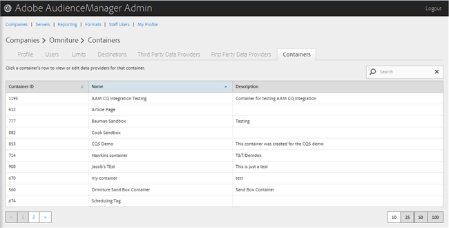
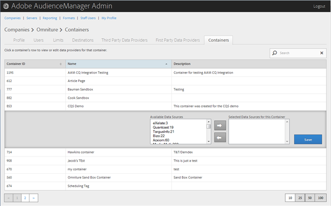

# 管理容器 {#manage-containers}

查看或编辑容器的数据提供者。

<!-- t_containers.xml -->

>[!NOTE]
>
>默认情况下，公司使用一个容器创建。 您可以在中的用户界面中为公司创建更多容器 **[!UICONTROL Manage Data > Tags]**。

1. 单 **[!UICONTROL Companies]**&#x200B;击，然后找到并单击所需的公司以显示其 [!UICONTROL Profile] 页面。

   使用列 [!UICONTROL Search] 表底部的框或分页控件查找所需的公司。 您可以通过单击所需列的标题，按升序或降序对每列进行排序。

1. Click the **[!UICONTROL Containers]** tab.

   

1. 单击容器的行可查看或编辑该容器的数据提供者。

   

1. 通过选择所需的数 **[!UICONTROL Available Data Sources]** 据源，然 **[!UICONTROL Selected Data Sources for This Container]** 后根据需要单击右箭头或左箭头，从和列表中移动数据源。

   您还可以从第三方数据提供 [商页面执行此](../companies/admin-third-party-providers.md#task_E942DD674D794BA6B8EFD52FD866E689)任务。

1. 如果 **[!UICONTROL Save]** 您进行了更改，请单击。

>[!MORE_LIKE_THIS]
>
>* [ID与Media Optimizer同步](../companies/admin-amo-sync.md#concept_2B5537233DAA4860B3503B344F937D83)

