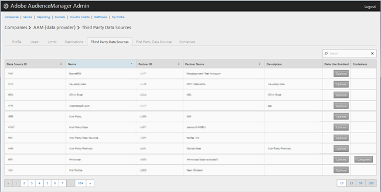
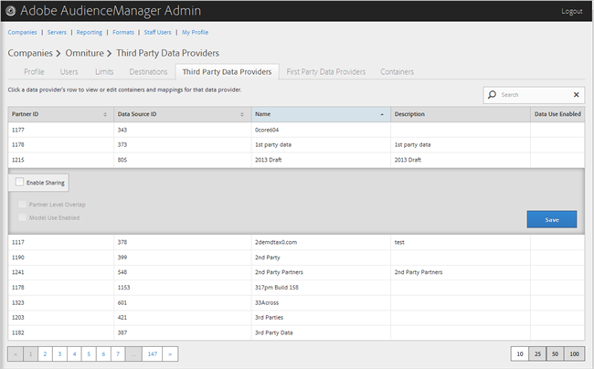

# 管理第三方数据提供商 {#manage-third-party-data-providers}

查看或编辑第三方数据提供者的容器和映射。 您还可以启用与不同数据提供者的共享。

1. 单 **[!UICONTROL Companies]**&#x200B;击，然后找到并单击所需的公司以显示其 [!UICONTROL Profile] 页面。

   使用列 [!UICONTROL Search] 表底部的框或分页控件查找所需的公司。 您可以通过单击所需列的标题，按升序或降序对每列进行排序。
1. Click the **[!UICONTROL Third Party Data Providers]** tab.

   

1. 单击数据提供者的行可查看或编辑该数据提供者的容器和映射。

   

1. 选择 **[!UICONTROL Enable Sharing]** 以启用以下选项：

   * **合作伙伴级别重叠：**
   * **** 启用模型使用：允许该公司在创建算法模型时使用此数据提供者。
   启用共享后，您即可从此数据提供者访问特征。

1. （视情况而定）如果为此提供者启用了容器，则可以通过将所需容器从可用列表移至选定列表来为此数据提供者选择容器。

   您还可以从“容器”页面执行 [此任](../companies/admin-manage-containers.md#task_61DB5CEECC5049DD8D059C642AC3F967) 务。
1. 如果 **[!UICONTROL Save]** 您进行了更改，请单击。