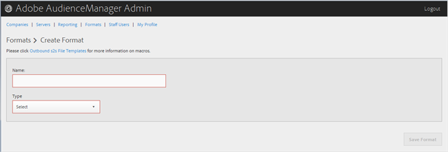

# 创建或编辑格式 {#create-or-edit-a-format}

使用Audience [!UICONTROL Formats] Manager管理工具中的页面创建新格式或编辑现有格式。

<!-- t_create_format.xml -->

>[!TIP]
>
>在为您的无界数据选择格式时，最好（如果可能）重新使用现有格式。 使用已经过验证的格式可确保成功生成出站数据。 要准确了解现有格式的格式，请单击菜 [!UICONTROL Formats] 单栏中的选项，然后按名称或ID编号搜索格式。 格式中使用的格式或宏的格式不正确将提供格式不正确的输出，或将阻止完全输出信息。

1. 要创建新格式，请单击 **[!UICONTROL Formats]** &gt; **[!UICONTROL Add Format]**。 要编辑现有格式，请单击列中所需的格 **[!UICONTROL Name]** 式。

   

1. 填写以下字段：
   * **** 名称：（必需）为格式提供描述性名称。
   * **** 类型：（必需）选择所需的格式：
      * **[!UICONTROL File]**:通过文件发送 [!DNL FTP] 数据。
      * **[!UICONTROL HTTP]**:将数据包含在包装 [!DNL JSON] 器中。

1. （视情况而定）如果您选 **[!UICONTROL File]**&#x200B;择，请填写以下字段：

   >[!NOTE]
   >
   >有关可用宏的列表，请参 [阅文件格式宏](../formats/file-formats.md#concept_A867101505074418A58DE325949E5089)[和HTTP格式宏](../formats/web-formats.md#reference_C392124A5F3F42E49F8AADDBA601ADFE)。

   * **[!UICONTROL File Name]** :指定数据传输文件的文件名。
   * **** 标题：指定在数据传输文件的第一行中显示的文本。
   * **[!UICONTROL Data Row]** :指定文件每行出界中显示的文本。
   * **[!UICONTROL Maximum File Size (In MB)]** :指定数据传输文件的最大文件大小。 压缩文件必须小于100 MB。 对未压缩的文件大小没有限制。
   * **[!UICONTROL Compression]** :选择所需的压缩类型：gz或zip。 要交付到 [!UICONTROL AWS S3]，必须使用。gz或未压缩文件。
   * **[!UICONTROL .info Receipt]** :指定生成一个转移控制([!DNL .info])文件。 该文 [!DNL .info] 件提供有关文件传输的元数据信息，以便合作伙伴可以验证Audience manager是否正确处理了文件传输。 有关详细信息，请参 [阅日志文件传输的传输控制文件](https://marketing.adobe.com/resources/help/en_US/aam/c_s2s_add_transfer_control_files.html)。
   * **[!UICONTROL MD5 Checksum Receipt]** :指定生成 [!DNL MD5] 校验和接收。 校验 [!DNL MD5] 和接收，以便合作伙伴可以验证Audience manager是否正确处理了完全传输。

1. （视情况而定）如果您选 **[!UICONTROL HTTP]**&#x200B;择，请填写以下字段：

   * **[!UICONTROL Method]** :选择 [!DNL API] 要用于传输流程的方法：
      * **[!UICONTROL POST]** :如果您选 [!DNL POST]择，请选择内容类型([!DNL XML] 或 [!DNL JSON])，然后指定请求正文。
      * **[!UICONTROL GET]** :如果选择 [!DNL GET]了查询参数。

1. 如果 **[!UICONTROL Create]** 要创建新格式，请单击，或者如果 **[!UICONTROL Save Updates]** 要编辑现有格式，则单击。

## 删除格式 {#delete-format}

1. 单击 **[!UICONTROL Formats]**.
2. 在所  需格 **[!UICONTROL Actions]** 式的列中单击。
3. Click **[!UICONTROL OK]** to confirm the deletion.
