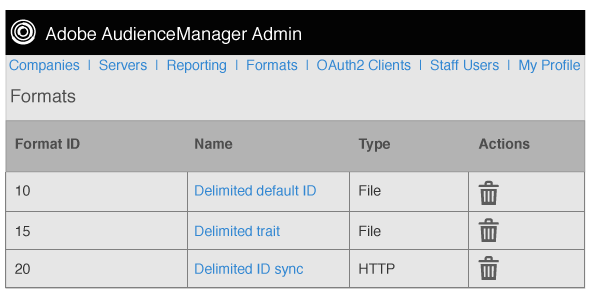

# 格式概述 {#formats-overview}

格式是保存的模板(或文件)，它使用宏组织发送到目标的数据的内容。格式类型包括 [!DNL HTTP] 格式和文件格式。[!DNL HTTP] 格式使用一个 [!DNL JSON][!DNL POST] 或 [!DNL GET] 多个方法发送对象中的数据。文件格式通过文件发送数据 [!DNL FTP]。每种格式所使用的宏允许您设置文件名、定义文件标题以及组织数据文件的内容。在管理员 [!DNL UI]中，您可以在为客户设置目标时创建、保存和重用格式。

